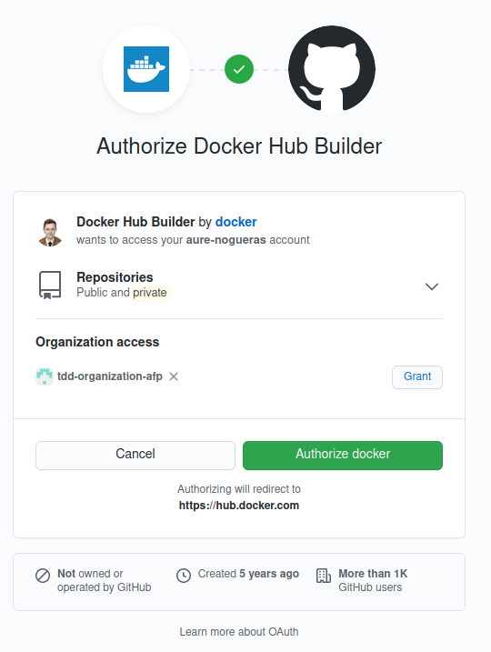
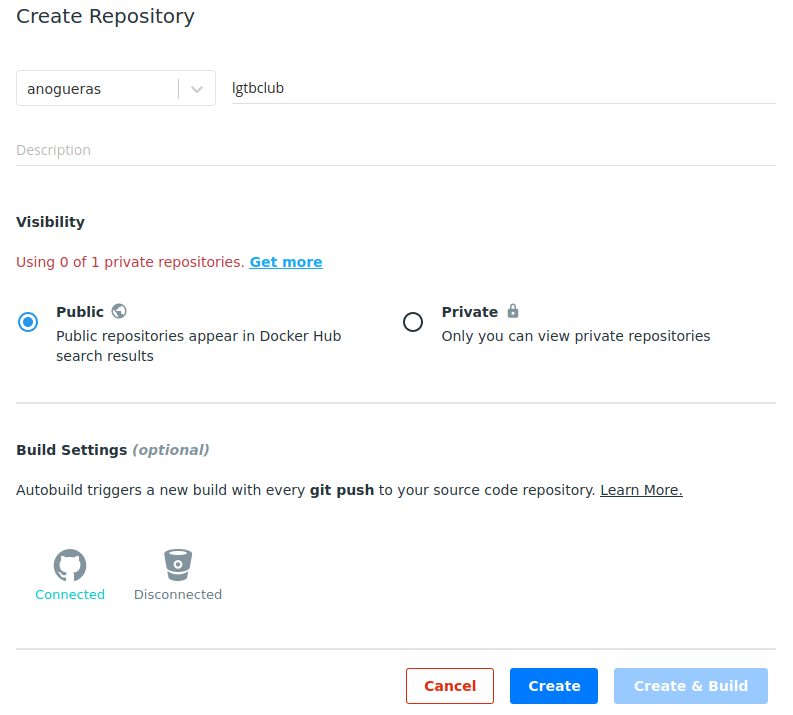
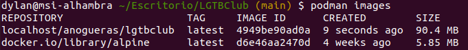

# LGTBClub

Proyecto de desarrollo de un sistema de divulgación de información del colectivo LGTB :rainbow_flag:.

[](https://www.gnu.org/licenses/gpl-3.0) [](https://travis-ci.org/github/aure-nogueras/LGTBClub)

La descripción del problema se puede consultar [aquí](https://aure-nogueras.github.io/LGTBClub/docs/descripcion_problema).


## Elección correcta y justificada del contenedor base

En primer lugar, pensé en usar *node*. Sin embargo, después de leer [esta página](https://blog.webbylab.com/minimal_size_docker_image_for_your_nodejs_app/), me di cuenta de que era poco recomendable. *Node* instala un número significativo de herramientas que no se van a usar, ocupando un tamaño innecesariamente grande. 

Como la simplicidad es una de las buenas prácticas que pueden seguirse en la virtualización ligera, finalmente he optado por *alpine*. Se trata de una imagen base de tamaño bastante reducido, lo que implica que sea rápida de cargar. Además, permite disfrutar de toda la funcionalidad necesaria sin consumir más espacio del requerido por el proyecto. 

## Dockerfile

Una vez seleccionado *alpine*, he creado la [primera versión](https://github.com/aure-nogueras/LGTBClub/commit/8650c8295a859ed535930b7ec9c6b37223b75f55) del *Dockerfile*. Para ello, he accedido a [esta página](https://nodejs.org/en/docs/guides/nodejs-docker-webapp/). Siguiendo las recomendaciones, también he creado un archivo *.dockerignore*. Esto permite no incluir ciertos archivos en el *build context*, ahorrando espacio. [Aquí](https://codefresh.io/docker-tutorial/not-ignore-dockerignore-2/) se explica la importancia de incluir un *.dockerignore*. Además, he concatenado todos los *RUN* en uno para evitar crear capas innecesarias y ocupar más tamaño del necesario.

A continuación, he leído sobre las buenas prácticas. Estas son algunas de las páginas que he consultado:

- [Reducir el tamaño de la imagen de *Docker* para tu aplicación con *nodejs*](https://blog.webbylab.com/minimal_size_docker_image_for_your_nodejs_app/).
- [Mejores prácticas con *Docker* y *nodejs*](https://github.com/nodejs/docker-node/blob/master/docs/BestPractices.md).

Así, he creado una [segunda versión] del *Dockerfile* cambiando algunos de los comandos. Por ejemplo, en lugar de copiar el directorio del proyecto por completo, solo he copiado las carpetas necesarias para la ejecución de los tests.

Por último, he añadido un usuario para que el contenedor se ejecute en modo no privilegiado. [Aquí](https://medium.com/redbubble/running-a-docker-container-as-a-non-root-user-7d2e00f8ee15) se explica la importancia de hacer esto. De este modo, nos aseguramos de que los archivos que se instalen no pertenezcan al *root* y puedan ser modificados por el usuario.

Dado que solo se instalan las dependencias requeridas para la ejecución de los tests y únicamente se copian los archivos necesarios, se ha conseguido una buena optimización de la imagen. Así, se trata de una imagen ligera y rápida. Aquí están enlazados los archivos:

- [Dockerfile](https://github.com/aure-nogueras/LGTBClub/blob/main/Dockerfile).
- [.dockerignore](https://github.com/aure-nogueras/LGTBClub/blob/main/.dockerignore).

También he intentado usar *multi-stage builds* para optimizar. Sin embargo, recurrir a esta técnica no reducía el tamaño de la imagen creada. Todos los pasos del *Dockerfile* debían realizarse en el mismo escenario para que el contenedor pudiera ejecutarse correctamente.

## Docker Hub

Para utilizar *Docker Hub*, he creado una cuenta y la he conectado con mi perfil de *GitHub*. No he podido elegir el mismo nombre que en *GitHub*, ya que tiene un carácter especial que no permitía. El nombre de la cuenta está incluido en el archivo [*DOCKER_USER*](https://github.com/aure-nogueras/LGTBClub/blob/main/DOCKER_USER).



A continuación, he creado un repositorio llamado *lgtbclub*. Lo he conectado con el proyecto en *GitHub*, de modo que cada *git push* ejecutará un nuevo *build*.



Se puede acceder a la imagen creada [aquí](https://hub.docker.com/r/anogueras/lgtbclub).

## GitHub Docker Registry

Además de subir la imagen a *Docker Hub*, he utilizado *GitHub Docker Registry*. He elegido esta alternativa porque me permite enlazar los paquetes de *Docker* al propio repositorio en el que se encuentra el proyecto. He accedido a varias páginas para conocer el funcionamiento de este registro:

- [Información sobre *GitHub Container Registry*](https://docs.github.com/es/free-pro-team@latest/packages/getting-started-with-github-container-registry/about-github-container-registry).
- [Configurar *Docker* para usar *GitHub Packages*](https://docs.github.com/es/free-pro-team@latest/packages/using-github-packages-with-your-projects-ecosystem/configuring-docker-for-use-with-github-packages#authenticating-to-paquetes-de-github).
- [Información sobre *GitHub Packages*](https://docs.github.com/es/free-pro-team@latest/packages/publishing-and-managing-packages/about-github-packages#authenticating-to-github-packages).
- [Crear un token de acceso personal](https://docs.github.com/es/free-pro-team@latest/github/authenticating-to-github/creating-a-personal-access-token).

De este modo, he creado un token de acceso personal para poder publicar, instalar y borrar Paquetes de *GitHub*. Una vez creado, lo he guardado en un archivo *TOKEN.txt* y he ejecutado `cat ~/TOKEN.txt | docker login https://docker.pkg.github.com -u aure-nogueras --password-stdin`. Así, me he autenticado en Paquetes de *GitHub*. Después, he ejecutado:

```
docker build -t docker.pkg.github.com/aure-nogueras/lgtbclub/lgtbclub .
docker push docker.pkg.github.com/aure-nogueras/lgtbclub/lgtbclub:latest
```
Con esto, el paquete se ha publicado y aparece [aquí](https://github.com/aure-nogueras/LGTBClub/packages/512900).

## Avance del proyecto

Se han tenido en cuenta los errores previos con respecto a enlazar demasiadas HUs en el mismo commit y se ha reducido el tamaño de los mensajes siguiendo el estándar 50/80.

- He probado [Podman](https://github.com/containers/podman). Para ello, lo he instalado siguiendo las instrucciones del [sitio oficial](https://podman.io/getting-started/installation). A continuación, lo he utilizado dentro de la carpeta del repositorio, de forma análoga a cómo se usa *Docker*. También se utiliza el archivo *Dockerfile* para construir la imagen.

```
podman build -t anogueras/lgtbclub .
```

Al comprobar las imágenes creadas, vemos:



El contenedor se ejecuta usando `podman run --rm -t localhost/anogueras/lgtbclub`.

- Me he dado de alta en [*CircleCI*](https://circleci.com/) con mi cuenta de *GitHub*. Se trata de una plataforma para realizar integración continua. Profundizaré más en su funcionamiento para incorporar mi proyecto más adelante.
 
- Para que la imagen de *Docker* genere un paquete automáticamente cada vez que hago `git push`, he recurrido a una *GitHub Action*. En primer lugar, he intentado crear una siguiendo varios tutoriales:
	- [Introducción a las *GitHub Actions*](https://docs.github.com/en/free-pro-team@latest/actions/learn-github-actions/introduction-to-github-actions).
	- [Publicar imágenes *Docker*](https://docs.github.com/en/free-pro-team@latest/actions/guides/publishing-docker-images).
	- [Configuración de *GitHub Actions*](https://docs.docker.com/ci-cd/github-actions/).
Sin embargo, algunos de los comandos estaban obsoletos y no conseguía que funcionara. Finalmente, he utilizado una *GitHub Action* disponible [aquí](https://github.com/marketplace/actions/publish-docker-images-to-gpr).
- Avance código.

## Documentación

La documentación se ubicará en el directorio [docs](https://github.com/aure-nogueras/ProyectoCC/tree/main/docs). 
- [Arquitectura elegida](https://aure-nogueras.github.io/LGTBClub/docs/arquitectura).
- [Planificación del proyecto](https://aure-nogueras.github.io/LGTBClub/docs/planificacion).
- [Configuración inicial del entorno para comenzar el desarrollo del proyecto](https://aure-nogueras.github.io/LGTBClub/docs/configuracion_entorno).
- [Elección de herramientas](https://aure-nogueras.github.io/LGTBClub/docs/eleccion_herramientas).
- [Descripción del problema](https://aure-nogueras.github.io/LGTBClub/docs/descripcion_problema).
- [Creación de las primeras clases](https://aure-nogueras.github.io/LGTBClub/docs/primeras_clases).


