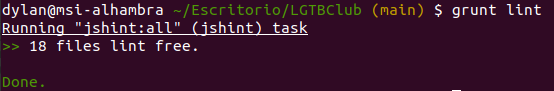

# LGTBClub

Proyecto de desarrollo de un sistema de divulgación de información del colectivo LGTB :rainbow_flag:.

[](https://www.gnu.org/licenses/gpl-3.0) [](https://travis-ci.org/github/aure-nogueras/LGTBClub)

La descripción del problema se puede consultar [aquí](https://aure-nogueras.github.io/LGTBClub/docs/descripcion_problema).


## Elección y justificación de la biblioteca de aserciones usada

Para elegir una biblioteca de aserciones he comparado *assert* y *Unexpected*. Finalmente he optado por utilizar *assert*. Esto se debe a que es la biblioteca estándar de *javascript*, con lo que no requiere la instalación de ninguna dependencia. Además, es muy sencilla de usar, y será interesante compararla con el marco de pruebas que se elija.

Estos son los tests ejecutados con la biblioteca de aserciones:
- En la carpeta *HistoricalEvent*: 
	- [*testHistoricalEvent.js*](https://github.com/aure-nogueras/LGTBClub/blob/main/src/HistoricalEvent/testHistoricalEvent.js)
	- [*testHistoricalEventController.js*](https://github.com/aure-nogueras/LGTBClub/blob/main/src/HistoricalEvent/testHistoricalEventController.js)
- En la carpeta *InfoAndExperiences*:
	- [*testInfoAndExperiences.js*](https://github.com/aure-nogueras/LGTBClub/blob/main/src/InfoAndExperiences/testInfoAndExperiences.js)
	- [*testInfoAndExperiencesController.js*](https://github.com/aure-nogueras/LGTBClub/blob/main/src/InfoAndExperiences/testInfoAndExperiencesController.js)
- En la carpeta *UserManagement*:
	- [*testUser.js*](https://github.com/aure-nogueras/LGTBClub/blob/main/src/UserManagement/testUser.js)
	- [*testUserController.js*](https://github.com/aure-nogueras/LGTBClub/blob/main/src/UserManagement/testUserController.js)

## Elección y justificación del marco de pruebas usado

En cuanto al marco de pruebas, he investigado acerca de la mejor opción. He considerado opciones como *Jasmine*, *Chai*, *Jest*, *AVA* o *Mocha*. Para elegir una de ellas, he observado las ventajas y desventajas de cada una.

En el caso de *AVA*, se trata de un marco de pruebas relativamente nuevo, con lo que no hay demasiada documentación al respecto. *Jasmine* y *Jest* también se han descartado debido a sus mensajes de error. *Jest* muestra múltiples mensajes para el mismo error, mientras que en *Jasmine*, los mensajes de error no son muy amigables. Entre *Chai* y *Mocha*, he seleccionado *Mocha*. Esto se debe a su gran popularidad y a que se basa en el *Behaviour Driven Development*. Aunque *Chai* consta de varias interfaces, ofreciendo al desarrollador la posibilidad de elegir entre el *Test Driven Development* y el *Behaviour Driven Development*, me parece más interesante optar directamente por el *BDD* con *Mocha*. De este modo, puedo describir el comportamiento del sistema a la vez que testeo sus funcionalidades.

- [*Mocha vs Jasmine, Chai, Sinon & Cucumber* en 2019](https://raygun.com/blog/mocha-vs-jasmine-chai-sinon-cucumber/).
- [¿Cuál es el mejor *framework* de tests unitarios para *Node.js*?](https://blog.logrocket.com/the-best-unit-testing-frameworks-for-node-js/).
- [*Chai*](https://www.chaijs.com/).

Estos son los tests ejecutados con el marco *Mocha*:

- En la carpeta *HistoricalEvent*: 
	- [*testHistoricalEventMocha.js*](https://github.com/aure-nogueras/LGTBClub/blob/main/src/HistoricalEvent/testHistoricalEventMocha.js)
	- [*testHistoricalEventControllerMocha.js*](https://github.com/aure-nogueras/LGTBClub/blob/main/src/HistoricalEvent/testHistoricalEventControllerMocha.js)
- En la carpeta *InfoAndExperiences*:
	- [*testInfoAndExperiencesMocha.js*](https://github.com/aure-nogueras/LGTBClub/blob/main/src/InfoAndExperiences/testInfoAndExperiencesMocha.js)
	- [*testInfoAndExperiencesControllerMocha.js*](https://github.com/aure-nogueras/LGTBClub/blob/main/src/InfoAndExperiences/testInfoAndExperiencesControllerMocha.js)
- En la carpeta *UserManagement*:
	- [*testUserMocha.js*](https://github.com/aure-nogueras/LGTBClub/blob/main/src/UserManagement/testUserMocha.js)
	- [*testUserControllerMocha.js*](https://github.com/aure-nogueras/LGTBClub/blob/main/src/UserManagement/testUserControllerMocha.js)


## Configuración del gestor de tareas y justificación de su elección

En la elección del gestor de tareas he comparado *Grunt* y *Gulp*. Dado que no he encontrado diferencias muy significativas que me hagan decantarme por uno o por otro, he decidido elegir *Grunt* por varios motivos. 
En primer lugar, *Grunt* es fácil de aprender y configurar. Además, consta de una gran comunidad de usuarios, lo cual es muy beneficioso para resolver dudas y acceder a documentación. Esto también implica que existen *plugins* para casi todas las funcionalidades que vayamos a necesitar. Por último, aunque *Grunt* pueda ser más lento que *Gulp*, la envergadura de este proyecto no es tan grande como para que suponga una desventaja significativa. 

- [*Gulp vs Grunt*](https://deliciousbrains.com/grunt-vs-gulp-battle-build-tools/).
- [*Grunt o Gulp*](https://blog.koalite.com/2015/06/grunt-o-gulp-que-uso/).
- [Diferencias entre *Grunt* y *Gulp*](https://svcministry.org/es/dictionary/what-are-the-differences-between-grunt-and-gulp-js/).
- [Comparativa entre *Grunt* y *Gulp*](https://www.ionos.es/digitalguide/paginas-web/desarrollo-web/gulp-vs-grunt-que-diferencia-a-estos-task-runners).

La configuración se empezó a realizar en la entrega anterior, tal y como se explica [aquí](https://aure-nogueras.github.io/LGTBClub/docs/primeras_clases). 

De este modo, primero se creó el archivo [*package.json*](https://github.com/aure-nogueras/LGTBClub/blob/main/package.json) y se añadieron las dependencias de *Grunt* con `npm install grunt --save-dev`. Después, se añadió el archivo [*Gruntfile.js*](https://github.com/aure-nogueras/LGTBClub/blob/main/Gruntfile.js) siguiendo [este tutorial](https://gruntjs.com/getting-started).

Con el avance del proyecto, se ha modificado bastante el *Gruntfile.js*. De este modo, incorpora tres *plugins*:
- *grunt-mocha-test*: para la ejecución de los tests de *Mocha*.
- *grunt-run*: para la ejecución de los tests de la biblioteca de aserciones.
- *grunt-jshint*: para comprobar la sintaxis de las clases.

Para ejecutar los tests, descargamos el proyecto y creamos un entorno virtual:

```
nvm use node
```

A continuación, estando en la carpeta del proyecto, instalamos las dependencias necesarias indicadas en el *package.json*:

```
npm install
```

Por último, ejecutamos:

```
grunt
```

*Gruntfile.js* está configurado para que se ejecuten los tests de *Mocha* y los tests de la biblioteca de aserción por defecto al usar `grunt`.

## Sintaxis

Tal y como se ha indicado, se ha recurrido al *plugin grunt-jshint*. De este modo, podemos seguir los siguientes pasos desde la carpeta del proyecto para comprobar la sintaxis de las clases.

```
nvm use node
npm install
grunt lint
```

Este ha sido el resultado obtenido:




## Correcta relación entre avance de código y HUs

El avance de código y las HUs se han ido enlazando a partir de los [*commits*](https://github.com/aure-nogueras/LGTBClub/commits/main). Además, en las respectivas clases del proyecto se puede ver la relación de cada una de las funciones del código con una o varias HU.

## Avance del proyecto

Se hicieron modificaciones en función de los errores de las entregas 1 (#4) y 2 (#38).

De este modo, he cambiado [la descripción del proyecto](https://aure-nogueras.github.io/LGTBClub/docs/descripcion_problema), [la planificación](https://aure-nogueras.github.io/LGTBClub/docs/planificacion) y [la justificación de la arquitectura elegida](https://aure-nogueras.github.io/LGTBClub/docs/arquitectura) entre otras cosas.

Con respecto al avance del proyecto, se tienen las siguientes clases y sus respectivos tests:
- [*HistoricalEvent.js*](https://github.com/aure-nogueras/LGTBClub/blob/main/src/HistoricalEvent/HistoricalEvent.js)
- [*HistoricalEventController.js*](https://github.com/aure-nogueras/LGTBClub/blob/main/src/HistoricalEvent/HistoricalEventController.js)
- [*InfoAndExperiences.js*](https://github.com/aure-nogueras/LGTBClub/blob/main/src/InfoAndExperiences/InfoAndExperiences.js)
- [*InfoAndExperiencesController.js*](https://github.com/aure-nogueras/LGTBClub/blob/main/src/InfoAndExperiences/InfoAndExperiencesController.js)
- [*User.js*](https://github.com/aure-nogueras/LGTBClub/blob/main/src/UserManagement/User.js)
- [*UserController.js*](https://github.com/aure-nogueras/LGTBClub/blob/main/src/UserManagement/UserController.js)

Además, se ha incorporado *Travis* como herramienta de integración continua.


## Documentación

La documentación se ubicará en el directorio [docs](https://github.com/aure-nogueras/ProyectoCC/tree/main/docs). 
- [Arquitectura elegida](https://aure-nogueras.github.io/LGTBClub/docs/arquitectura).
- [Planificación del proyecto](https://aure-nogueras.github.io/LGTBClub/docs/planificacion).
- [Configuración inicial del entorno para comenzar el desarrollo del proyecto](https://aure-nogueras.github.io/LGTBClub/docs/configuracion_entorno).
- [Elección de herramientas](https://aure-nogueras.github.io/LGTBClub/docs/eleccion_herramientas).
- [Descripción del problema](https://aure-nogueras.github.io/LGTBClub/docs/descripcion_problema).
- [Creación de las primeras clases](https://aure-nogueras.github.io/LGTBClub/docs/primeras_clases).


