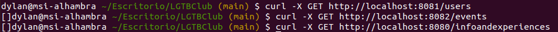
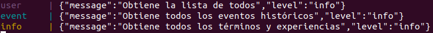
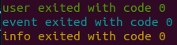
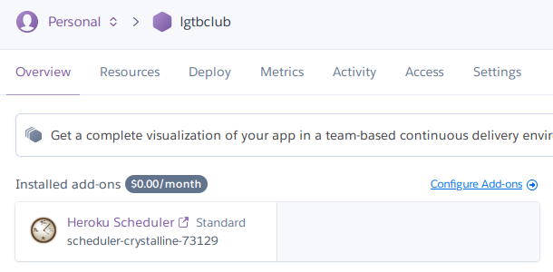
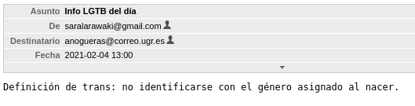

# LGTBClub

Proyecto de desarrollo de un sistema de divulgación de información del colectivo LGTB :rainbow_flag:.

   

La descripción del problema se puede consultar [aquí](https://aure-nogueras.github.io/LGTBClub/docs/descripcion_problema).

## Estructura del clúster

Se han construido cuatro contenedores:

- **user**: contiene el microservicio relativo a los usuarios, *UserManagement*. 
- **info**: contiene el microservicio relativo al módulo *InfoAndExperiences*. 
- **event**: contiene el microservicio de *HistoricalEvent*. 
- **log**: este contenedor se ha incluido para los logs usando *Logstash*. 

Los contenedores relativos a los microservicios permiten desplegarlos en diferentes puertos para que estén activos al mismo tiempo. Este ha sido el criterio a la hora de separarlos. Por otro lado, los logs son útiles para registrar qué ocurre en cada momento. Son un servicio de configuración necesario para usar junto con los microservicios.

## Configuración de cada uno de los contenedores

Vamos a ver la configuración de cada contenedor por separado:

- **user**: se basa en el archivo [*user.Dockerfile*](https://github.com/aure-nogueras/LGTBClub/blob/main/user.Dockerfile). Dicho archivo construye un contenedor sobre el que utiliza el comando `grunt user`, que despliega el microservicio de los usuarios en el puerto `8081`.
- **info**: se basa en el archivo [*info.Dockerfile*](https://github.com/aure-nogueras/LGTBClub/blob/main/info.Dockerfile). De igual manera que en el caso anterior, construye un contenedor sobre el que desplegar el microservicio. En este caso, alude al microservicio relativo a información sobre términos y experiencias. Se utiliza el puerto `8080` y se ejecuta `grunt info`.
- **event**: este contenedor se construye con el archivo [*event.Dockerfile*](https://github.com/aure-nogueras/LGTBClub/blob/main/event.Dockerfile). Se lanza el microservicio relacionado con los eventos históricos sobre el puerto `8082`, usando el comando `grunt event`.
- **log**: se construye a partir de [esta imagen](https://hub.docker.com/r/bitnami/logstash/). Además, incluye un archivo de configuración llamado [*log.env*](https://github.com/aure-nogueras/LGTBClub/blob/main/log.env).

La configuración de los *Dockerfile* es muy similar al *Dockerfile* inicial. Esto se debe a que la funcionalidad es muy parecida. Principalmente cambia el hecho de que estos archivos ejecutan el servidor de cada microservicio, mientras que el [*Dockerfile*](https://github.com/aure-nogueras/LGTBClub/blob/main/Dockerfile) inicial lanza los tests. Además, dado que se siguieron las mejores prácticas en la construcción del primer *Dockerfile*, se ha procedido del mismo modo en este caso.

Con respecto a los microservicios de *InfoAndExperiences* y *HistoricalEvent*, solo se han copiado sus respectivas carpetas en los contenedores, evitando incluir contenido innecesario. En el caso de *UserManagement*, el *Dockerfile* sí descarga la carpeta *src* completa, ya que algunas funciones utilizan los módulos de *InfoAndExperiences* y *HistoricalEvent*.

## Fichero de composición

Para elaborar el [fichero de composición](https://github.com/aure-nogueras/LGTBClub/blob/main/docker-compose.yml), se ha consultado la documentación oficial de [*Docker*](https://docs.docker.com/compose/gettingstarted/). Así, para cada uno de los servicios se ha especificado la ubicación de su correspondiente *Dockerfile* (en el caso de log, su imagen en *Docker Hub*), los puertos a los que debe conectarse y una red común para conectarlos todos entre sí. Para ello, se ha utilizado el driver *bridge* que se emplea por defecto. 

Para ejecutar el fichero, se pueden usar `docker-compose build` y `docker-compose up` sobre el directorio raíz. Vamos a comprobar el correcto funcionamiento de la composición. De este modo, lanzo `docker-compose up` en una terminal y realizo peticiones desde otra.

Si miramos la terminal donde se está ejecutando `docker-compose up`, vemos que las peticiones se reciben:

## Testeo del fichero de composición

A la hora de elaborar los tests para el fichero de composición, se ha creado el archivo [*docker-compose-tests.yml*](https://github.com/aure-nogueras/LGTBClub/blob/main/docker-compose-tests.yml). Se han decidido probar los contenedores relativos a los microservicios, ya que el log no contiene nada sobre lo que realizar tests. 

Así, el fichero se asemeja a [*docker-compose.yml*](https://github.com/aure-nogueras/LGTBClub/blob/main/docker-compose.yml), pero en este caso tenemos tres contenedores y se especifican algunos comandos que se ejecutan al desplegar los servicios. Para ello, se ha modificado el [*Gruntfile.js*](https://github.com/aure-nogueras/LGTBClub/blob/main/Gruntfile.js), separando los tests de cada módulo. De este modo, cada microservicio ejecuta `grunt` seguido de la palabra relativa a sus correspondientes tests.

Si ejecutamos `docker-compose -f docker-compose-tests.yml up`, vemos que los tests se realizan con éxito:

## Avance del proyecto

Además de los puntos anteriores, se ha avanzado el proyecto en dos ámbitos:

- Por un lado, se ha cambiado el servicio de configuración remota. Inicialmente se utilizaba *etcd*, pero se ha considerado que era mejor optar por usar *Consul*. Esto se debe a que *Consul* tiene alta disponibilidad, permite integración con *Docker* y ofrece monitorización. Las ventajas que ofrece son muy amplias con respecto a *etcd*, con lo que se han modificado los ficheros de configuración para optar por esta alternativa.
- Por otro lado, se ha comenzado el despliegue del servicio en la nube utilizando *Heroku*. Se trata de una herramienta muy interesante que había utilizado brevemente y en la que me interesaba profundizar más. De este modo, he consultado documentación relativa a su uso con *Node.js*:
	- [*Heroku* con *Node.js*](https://devcenter.heroku.com/articles/getting-started-with-nodejs).
	- [*Procfile*](https://devcenter.heroku.com/articles/procfile).
	
	Dado que aún no he implementado la conexión con la base de datos para mi proyecto, he optado por usar *Heroku* para probar la funcionalidad de envío de emails que tendría la aplicación una vez terminada. Así, he investigado sobre la planificación y sobre el módulo *Nodemailer*:

	- [Enviar emails desde *Node.js*](https://medium.com/@uesteibar/env%C3%ADa-emails-desde-node-js-con-nodemailer-178cacf5cf6b).
	- [Planificar trabajos con *Heroku*](https://medium.com/@gbuszmicz/cron-jobs-in-node-js-with-heroku-5f3c808b4d57).
	- [*Nodemailer*](https://nodemailer.com/smtp/).
	- [Planificador con *Heroku* y *Node.js*](http://www.modeo.co/blog/2015/1/8/heroku-scheduler-with-nodejs-tutorial).
	
	Una vez consultada la documentación, he seguido el tutorial del último enlace. Así, he configurado *Heroku* con mi repositorio y he añadido el planificador.
	
	
	
	He añadido el archivo [*mailController.js*](https://github.com/aure-nogueras/LGTBClub/blob/main/src/main/mailController.js) en una nueva carpeta llamada *main*. Este archivo manda un email de prueba a mi correo. Mediante el planificador, he configurado esta tarea para que se lleve a cabo diariamente, ejecutando `grunt email`. Así, cada día a la misma hora se mandarían emails a los correos registrados en la base de datos con información sobre el colectivo LGTB. Este es el correo de prueba que he enviado a mi dirección de email:
	
	
	
## Documentación

La documentación se ubicará en el directorio [docs](https://github.com/aure-nogueras/ProyectoCC/tree/main/docs). 
- [Arquitectura elegida](https://aure-nogueras.github.io/LGTBClub/docs/arquitectura).
- [Planificación del proyecto](https://aure-nogueras.github.io/LGTBClub/docs/planificacion).
- [API REST](https://aure-nogueras.github.io/LGTBClub/docs/rest).
- [Configuración inicial del entorno para comenzar el desarrollo del proyecto](https://aure-nogueras.github.io/LGTBClub/docs/configuracion_entorno).
- [Contenedores](https://aure-nogueras.github.io/LGTBClub/docs/contenedores).
- [Integración continua](https://aure-nogueras.github.io/LGTBClub/docs/integracion_continua).
- [Elección de herramientas](https://aure-nogueras.github.io/LGTBClub/docs/eleccion_herramientas).
- [Descripción del problema](https://aure-nogueras.github.io/LGTBClub/docs/descripcion_problema).
- [Creación de las primeras clases](https://aure-nogueras.github.io/LGTBClub/docs/primeras_clases).

