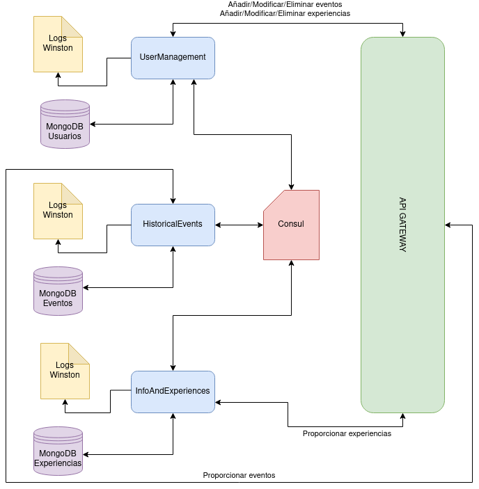

# LGBTClub

Proyecto de la asignatura *Cloud Computing* del Máster de Ingeniería Informática de la UGR. Curso 2020-2021.

La descripción del problema se puede consultar [aquí](https://aure-nogueras.github.io/LGBTClub/docs/descripcion_problema).

El plan de desarrollo se puede ver [aquí](https://github.com/aure-nogueras/LGBTClub/projects/1).

## Arquitectura del problema

Para abordar el problema se ha elegido una arquitectura basada en microservicios, ya que van a desplegarse tres funcionalidades independientes. Dichos microservicios son:

- **UserManagement**: se encargará de la gestión de los usuarios. Sus funciones serán:
	- Suscribirse al servicio de mensajería.
	- Desuscribirse del servicio de mensajería.
	- Añadir eventos históricos.
	- Modificar eventos históricos añadidos.
	- Eliminar eventos históricos añadidos.
	- Añadir experiencias personales o información.
	- Modificar experiencias personales o información añadida.
	- Eliminar experiencias personales o información añadida.
- **HistoricalEvents**: gestiona los eventos históricos y las fechas señaladas para el colectivo.
	- Proporcionar información sobre eventos históricos o días señalados.
- **InfoAndExperiences**: gestiona la información sobre los términos, las experiencias personales y los falsos mitos del colectivo.
	- Proporcionar información sobre terminología y experiencias personales.
	
Para comunicar los servicios se utilizará una *API-GATEWAY*.

El resto de herramientas elegidas se especifica [aquí](https://aure-nogueras.github.io/LGBTClub/docs/eleccion_herramientas) y la construcción de las primeras clases [aquí](https://aure-nogueras.github.io/LGBTClub/docs/primeras_clases).

## Documentación

La documentación se ubicará en el directorio [docs](https://github.com/aure-nogueras/ProyectoCC/tree/main/docs). 
- [Configuración inicial del entorno para comenzar el desarrollo del proyecto](https://aure-nogueras.github.io/LGBTClub/docs/configuracion_entorno).
- [Elección de herramientas](https://aure-nogueras.github.io/LGBTClub/docs/eleccion_herramientas).
- [Descripción del problema](https://aure-nogueras.github.io/LGBTClub/docs/descripcion_problema).
- [Creación de las primeras clases](https://aure-nogueras.github.io/LGBTClub/docs/primeras_clases).

## Historias de usuario

- [[HU1] Añadir eventos históricos o días de celebración como usuario](https://github.com/aure-nogueras/LGBTClub/issues/12).
- [[HU2] Añadir términos o experiencias personales como usuario LGTB](https://github.com/aure-nogueras/LGBTClub/issues/13).
- [[HU3] Eliminar eventos históricos o días de celebración como usuario](https://github.com/aure-nogueras/LGBTClub/issues/14).
- [[HU4] Eliminar términos o experiencias personales como usuario LGTB](https://github.com/aure-nogueras/LGBTClub/issues/15).
- [[HU5] Modificar eventos históricos o días de celebración como usuario](https://github.com/aure-nogueras/LGBTClub/issues/16).
- [[HU6] Modificar términos o experiencias personales como usuario LGTB](https://github.com/aure-nogueras/LGBTClub/issues/17).
- [[HU7] Suscribirse al servicio de mensajes como usuario](https://github.com/aure-nogueras/LGBTClub/issues/18).
- [[HU8] Desuscribirse del servicio de mensajería como usuario](https://github.com/aure-nogueras/LGBTClub/issues/19).
- [[HU9] Añadir eventos históricos o días de celebración como administrador](https://github.com/aure-nogueras/LGBTClub/issues/20).
- [[HU10] Añadir términos o experiencias personales como administrador](https://github.com/aure-nogueras/LGBTClub/issues/21).
- [[HU11] Eliminar eventos históricos o días de celebración como administrador](https://github.com/aure-nogueras/LGBTClub/issues/22).
- [[HU12] Eliminar términos o experiencias personales como administrador](https://github.com/aure-nogueras/LGBTClub/issues/23).
- [[HU13] Modificar eventos históricos o días de celebración como administrador](https://github.com/aure-nogueras/LGBTClub/issues/24).
- [[HU14] Modificar términos o experiencias personales como administrador](https://github.com/aure-nogueras/LGBTClub/issues/25).
- [[HU15] Dar de alta a un usuario al servicio de mensajería como administrador](https://github.com/aure-nogueras/LGBTClub/issues/26).
- [[HU16] Dar de baja a un usuario del servicio de mensajería como administrador](https://github.com/aure-nogueras/LGBTClub/issues/27).
- [[HU17] Modificar los datos de un usuario suscrito al servicio de mensajería como administrador](https://github.com/aure-nogueras/LGBTClub/issues/28).

## Milestones e issues resueltos

- [Documentación](https://github.com/aure-nogueras/LGBTClub/milestone/2)
   - [Incluir documentación de configuración de GitHub](https://github.com/aure-nogueras/LGBTClub/issues/2)
   - [Incluir documentación sobre herramientas elegidas](https://github.com/aure-nogueras/LGBTClub/issues/11)
   - [Mover descripción del problema del readme a docs](https://github.com/aure-nogueras/LGBTClub/issues/30)
   - [Indicar cómo se ha realizado la creación de las primeras clases](https://github.com/aure-nogueras/LGBTClub/issues/31)
   - [Añadir HU al readme](https://github.com/aure-nogueras/LGBTClub/issues/36)
- [Configuración básica del repositorio](https://github.com/aure-nogueras/LGBTClub/milestone/1)
   - [Añadir GitHub Pages](https://github.com/aure-nogueras/LGBTClub/issues/3)
   - [Terminar configuración inicial del repositorio](https://github.com/aure-nogueras/LGBTClub/issues/1)
- [Solucionar errores](https://github.com/aure-nogueras/LGBTClub/milestone/4)
   - [Arreglar errores iniciales](https://github.com/aure-nogueras/LGBTClub/issues/4)
   - [Modificar descripción del problema](https://github.com/aure-nogueras/LGBTClub/issues/29)
   - [Arreglar sintaxis de cc.yaml](https://github.com/aure-nogueras/LGBTClub/issues/33)
   - [Arreglar error en estructura de clases](https://github.com/aure-nogueras/LGBTClub/issues/34)
- [Integración continua](https://github.com/aure-nogueras/LGBTClub/milestone/5)
   - [Añadir travis.yml](https://github.com/aure-nogueras/LGBTClub/issues/5)
   - [Incluir repositorio en Travis](https://github.com/aure-nogueras/LGBTClub/issues/6)
   - [Arreglar error en .travis.yml](https://github.com/aure-nogueras/LGBTClub/issues/7)
   - [Arreglar errata en primeras_clases y en cc.yaml](https://github.com/aure-nogueras/LGBTClub/issues/32)
   - [Añadir badge de travis](https://github.com/aure-nogueras/LGBTClub/issues/8)
   - [Corregir el build de Travis](https://github.com/aure-nogueras/LGBTClub/issues/35)
- [Explicación de la arquitectura del proyecto](https://github.com/aure-nogueras/LGBTClub/milestone/3)
   - [Añadir arquitectura en readme](https://github.com/aure-nogueras/LGBTClub/issues/9)
   - [Añadir diagrama de la arquitectura de la aplicación](https://github.com/aure-nogueras/LGBTClub/issues/10) 
   
	 
	 
