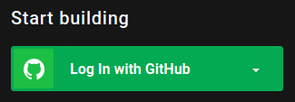
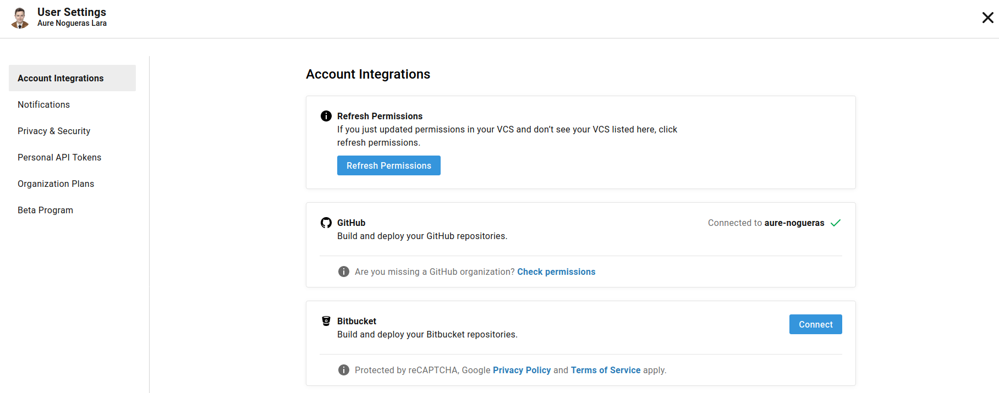
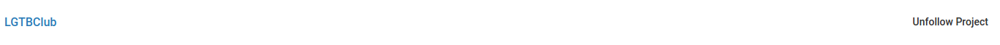
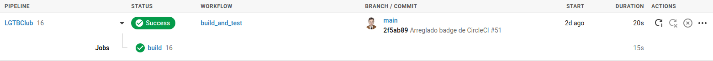
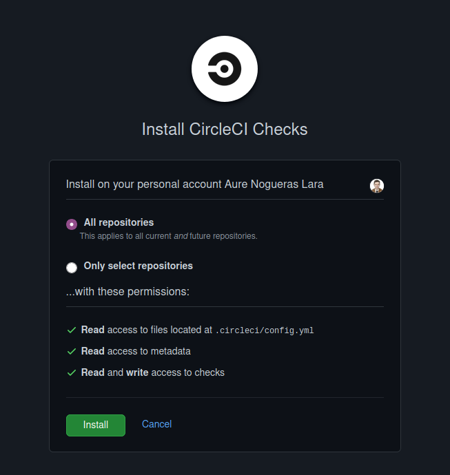

# LGTBClub

Proyecto de desarrollo de un sistema de divulgación de información del colectivo LGTB :rainbow_flag:.

[](https://www.gnu.org/licenses/gpl-3.0) [](https://travis-ci.org/github/aure-nogueras/LGTBClub) [](https://app.circleci.com/pipelines/github/aure-nogueras/LGTBClub?branch=main) [](https://github.com/aure-nogueras/LGTBClub/actions)

La descripción del problema se puede consultar [aquí](https://aure-nogueras.github.io/LGTBClub/docs/descripcion_problema).

## Justificación de la integración continua

La integración continua es muy útil para asegurar la calidad del proyecto que se está desarrollando. De este modo, el uso de tests que se ejecutan de forma automática después de cada modificación que se añade al repositorio permite comprobar su correcto funcionamiento. Esto también es fundamental para el posterior despliegue de la aplicación en la nube.

El primer sistema de integración continua utilizado para este proyecto es *Travis*. De este modo, he accedido a la web a través de mi cuenta de *GitHub*.


A continuación, he seguido los pasos indicados [aquí](https://docs.travis-ci.com/user/tutorial/?utm_source=help-page&utm_medium=travisweb). Primero he accedido a los *settings* de mi perfil en *Travis*. Una vez ahí, se despliega una lista con mis repositorios. He seleccionado el repositorio correspondiente al proyecto, [*LGTBClub*](https://github.com/aure-nogueras/LGTBClub).


Por último, he creado el archivo [*.travis.yml*](https://github.com/aure-nogueras/LGTBClub/blob/main/.travis.yml) y lo he añadido al repositorio. Este es su contenido:

```
language: node_js
node_js:
- "10"
- "12"
- "14.4.0"
install:
- npm install
script:
- grunt test

```


## Configuración de un sistema de integración continua adicional

El segundo sistema que he elegido para realizar la integración continua ha sido [*CircleCI*](https://circleci.com/). Esto se debe a varios motivos. En primer lugar, se trata de un sistema en la nube en el que se puede utilizar la propia cuenta de *GitHub* para conectar los repositorios deseados. Además, al igual que con *Travis*, permite activar el *checks API*. Esto implica que se puede consultar desde el repositorio de *GitHub* el estado de la integración y el funcionamiento de los tests. De este modo, se puede consultar el *build* en cualquier momento sin tener que acceder a *CircleCI* directamente. Para añadir esto a mi repositorio he consultado [esta página](https://circleci.com/docs/2.0/enable-checks/).

Para configurar *CircleCI*, se han seguido unos pasos muy similares a los llevados a cabo en *Travis*. En primer lugar, he accedido a la página conectándome con mi perfil de *GitHub*. 



En los ajustes puede comprobarse que, efectivamente, el perfil está conectado a *GitHub*.



A continuación, he activado el repositorio del proyecto en el que voy a aplicar la integración continua. En este caso, he accedido a todos mis repositorios desde la pestaña *Projects* y he seleccionado el correspondiente a [*LGTBClub*](https://github.com/aure-nogueras/LGTBClub) integración continua con *CircleCI*.



Por último, he creado una carpeta [*.circleci*](https://github.com/aure-nogueras/LGTBClub/tree/main/.circleci) en mi proyecto, donde he guardado el archivo de configuración [*config.yml*](https://github.com/aure-nogueras/LGTBClub/blob/main/.circleci/config.yml). Este es el contenido de dicho archivo:

```
--- 
jobs: 
  build: 
    docker: 
      - image: anogueras/lgtbclub:latest
        auth:
          username: $DOCKER_HUB_USERNAME
          password: $DOCKER_HUB_PASSWORD
    working_directory: /app
    steps:
      - run: 
          name: Run tests
          command: grunt test
     
version: 2.1
workflows: 
  build_and_test: 
    jobs: 
      - build

```

Con este archivo de configuración, uso la imagen creada en *Docker* para ejecutar los tests de la aplicación. Cada vez que hago un nuevo *push* en el repositorio, puedo ver los resultados en *CircleCI*.



También he añadido el *badge* a este README.md y he activado el *checks API* como se puede ver en la imagen.



## Uso correcto del gestor de tareas en la integración continua


## Aprovechamiento del contenedor de Docker 

## Avance del proyecto

Además de esto, he avanzado el proyecto en dos puntos:

- He incorporado nuevas funciones y tests al código, relativas a comprobar si un usuario está suscrito al servicio de mensajería. Para ello, he creado la HU18 y un nuevo issue.
	- [HU18 Saber si estoy suscrito como usuario](https://github.com/aure-nogueras/LGTBClub/issues/56).
	- [Como desarrollador, quiero comprobar que cualquier modificación es realizada por un usuario suscrito](https://github.com/aure-nogueras/LGTBClub/issues/55).
  
  Esto ha introducido cambios en las siguientes clases:
  
  	- [User.js](https://github.com/aure-nogueras/LGTBClub/blob/main/src/UserManagement/User.js).
  	- [UserController.js](https://github.com/aure-nogueras/LGTBClub/blob/main/src/UserManagement/UserController.js).
  	- [testUser.js](https://github.com/aure-nogueras/LGTBClub/blob/main/src/UserManagement/testUser.js).
  	- [testUserController.js](https://github.com/aure-nogueras/LGTBClub/blob/main/src/UserManagement/testUserController.js).
  	- [testUserControllerMocha.js](https://github.com/aure-nogueras/LGTBClub/blob/main/src/UserManagement/testUserControllerMocha.js).
  	- [testUserMocha.js](https://github.com/aure-nogueras/LGTBClub/blob/main/src/UserManagement/testUserMocha.js).

  Los cambios pueden consultarse en los commits.

- He añadido un tercer sistema de integración continua mediante las *GitHub Actions*.

## Documentación

La documentación se ubicará en el directorio [docs](https://github.com/aure-nogueras/ProyectoCC/tree/main/docs). 
- [Arquitectura elegida](https://aure-nogueras.github.io/LGTBClub/docs/arquitectura).
- [Planificación del proyecto](https://aure-nogueras.github.io/LGTBClub/docs/planificacion).
- [Configuración inicial del entorno para comenzar el desarrollo del proyecto](https://aure-nogueras.github.io/LGTBClub/docs/configuracion_entorno).
- [Contenedores](https://aure-nogueras.github.io/LGTBClub/docs/contenedores).
- [Elección de herramientas](https://aure-nogueras.github.io/LGTBClub/docs/eleccion_herramientas).
- [Descripción del problema](https://aure-nogueras.github.io/LGTBClub/docs/descripcion_problema).
- [Creación de las primeras clases](https://aure-nogueras.github.io/LGTBClub/docs/primeras_clases).


