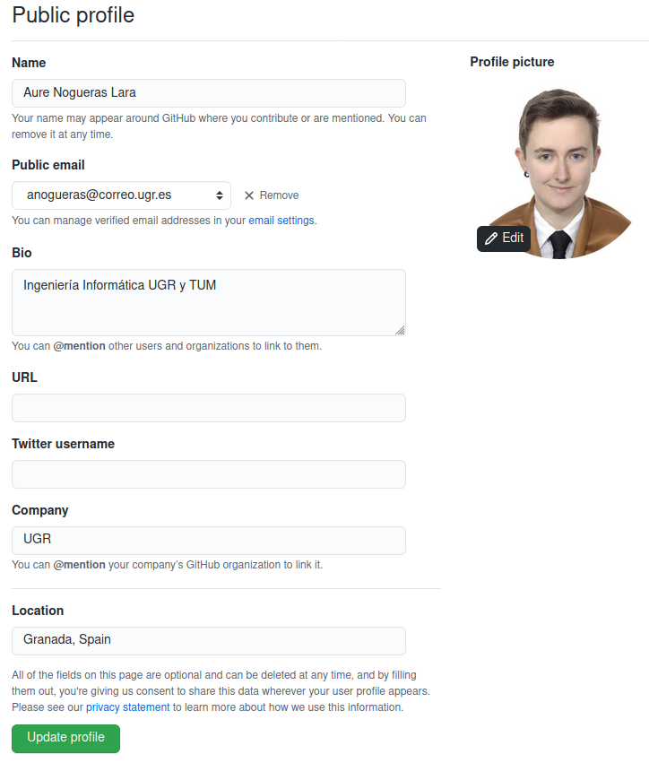
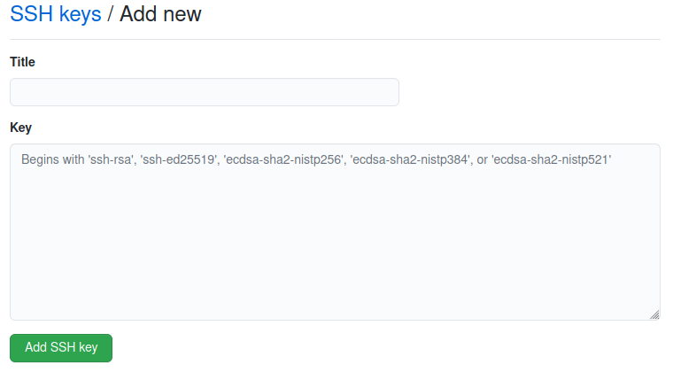
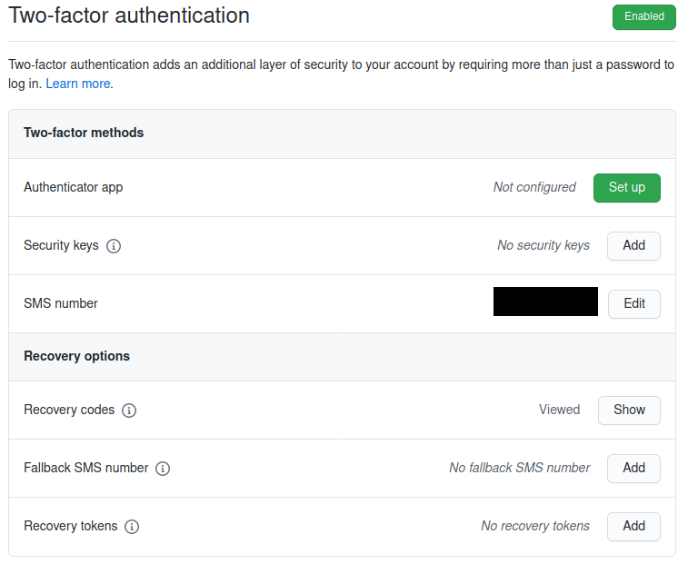

# Documentación

## Configuración del entorno 

### Datos del perfil de GitHub

En primer lugar, he accedido a mi perfil y he completado los datos que faltaban: nombre completo, ciudad, universidad e icono con mi foto.

De este modo, el resultado del perfil ha quedado así.

### Generación de claves

A continuación, he creado un par de claves pública y privada para usar las conexiones *SSH* siguiendo [la documentación de *GitHub*](https://docs.github.com/es/free-pro-team@latest/github/authenticating-to-github/generating-a-new-ssh-key-and-adding-it-to-the-ssh-agent). Así, he abierto la terminal en *Linux* y he usado el siguiente comando:

`ssh-keygen -t rsa -b 4096 -C "anogueras@correo.ugr.es"`

Una vez guardadas las claves y creado una *passphrase*, he copiado la clave pública en el portapapeles:

`cat ~/.ssh/id_rsa.pub`

Después he accedido a *GitHub* y he pinchado en *Settings*. Dentro de la opción *SSH and GPG keys*, le he dado a añadir una nueva clave *SSH*.

En la ventana desplegada, he pegado la clave pública.

### Doble autenticación

Desde los ajustes de *GitHub*, también he accedodo a *Account security* para activar el segundo factor de autenticación. Esto permite incrementar la seguridad de la cuenta, solicitando una segunda clave que se manda en un *sms* a mi teléfono móvil cada vez que inicio sesión en *GitHub* desde un nuevo dispositivo.

### Configuración git local

Para establecer mi nombre de usuario y mi email desde la terminal, he utilizado:

`git config --global user.name "aure-nogueras"`

`git config --global user.email "anogueras@correo.ugr.es"`

Así, los *commits* usarán esta información cuando sean enviados. Además, he añadido que `git pull` siempre sea `rebase`.

`git config --global pull.rebase true`

Por último, a la hora de hacer `fork` en el repositorio [*CC-20-21*](https://github.com/JJ/CC-20-21) y clonarlo, he configurado el remoto en mi ordenador del siguiente modo:

`git remote add upstream git@github.com:JJ/CC-20-21.git`
